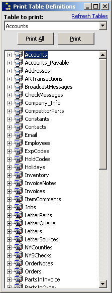



## Print Field Definitions for SQL Tables

### Description

Enter your SQL server's information, and easily select a table (or all of them), and the application will print the Table's Field properties... Great for a quick-reference. 

----

BE SURE TO SET THE CONSTs IN MODULE1 TO REFLECT YOUR SERVER SETTINGS

----

 
### More Info
 

             |
---                |---
**Submitted On**   |2004-07-29 09:49:58
**By**             |[\[\]\)utch\[\]v\[\]aster](https://github.com/Planet-Source-Code/PSCIndex/blob/master/ByAuthor/utch-v-aster.md)
**Level**          |Intermediate
**User Rating**    |5.0 (15 globes from 3 users)
**Compatibility**  |VB 5\.0, VB 6\.0
**Category**       |[Databases/ Data Access/ DAO/ ADO](https://github.com/Planet-Source-Code/PSCIndex/blob/master/ByCategory/databases-data-access-dao-ado__1-6.md)
**World**          |[Visual Basic](https://github.com/Planet-Source-Code/PSCIndex/blob/master/ByWorld/visual-basic.md)
**Archive File**   |[Print\_Fiel1775387292004\.zip](https://github.com/Planet-Source-Code/utch-v-aster-print-field-definitions-for-sql-tables__1-55230/archive/master.zip)

